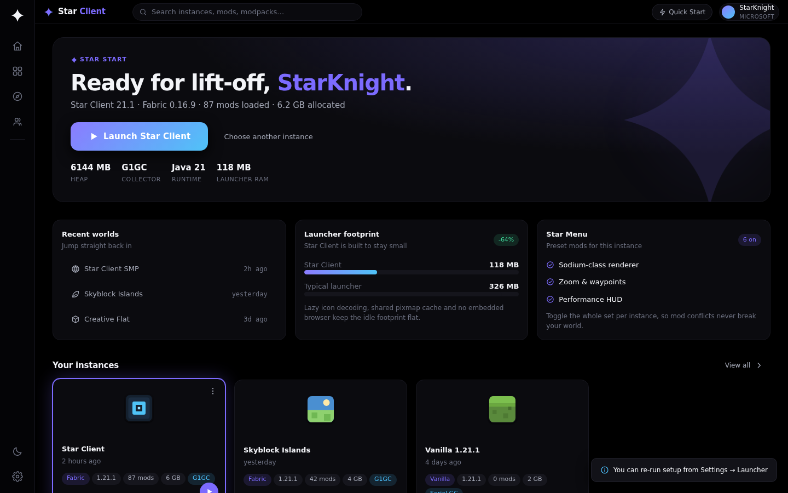
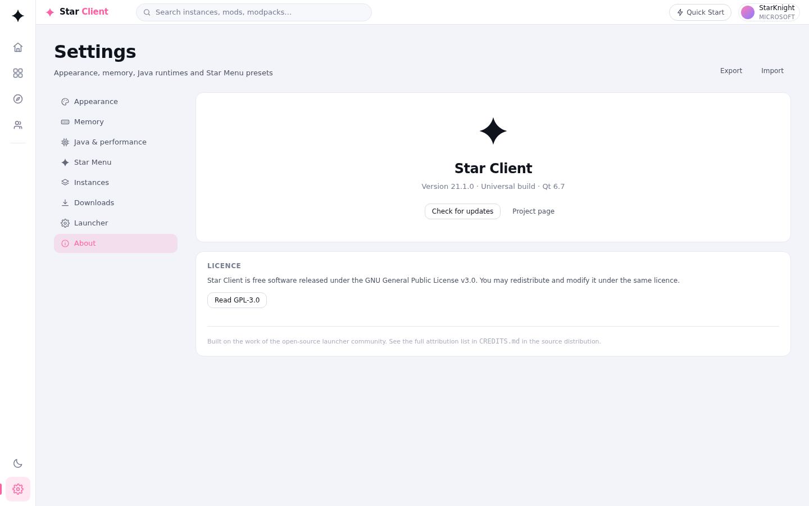
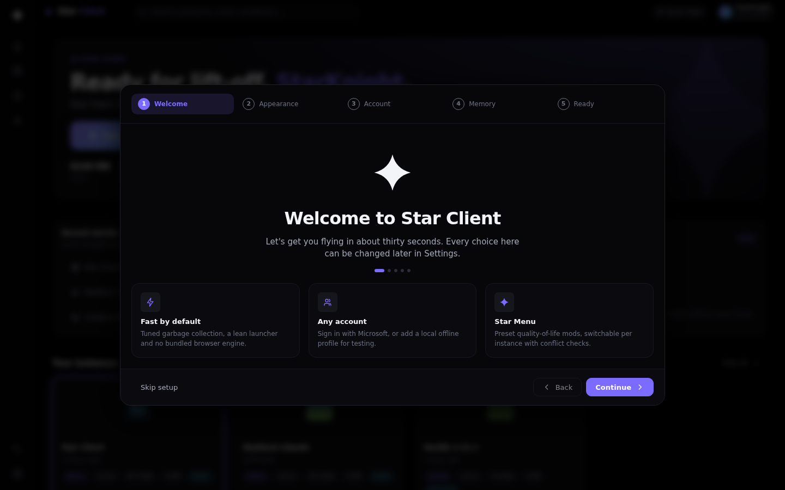
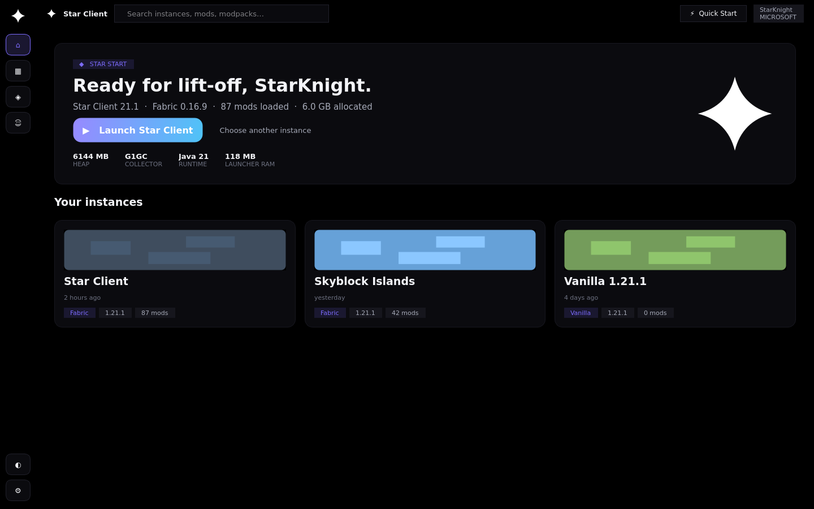
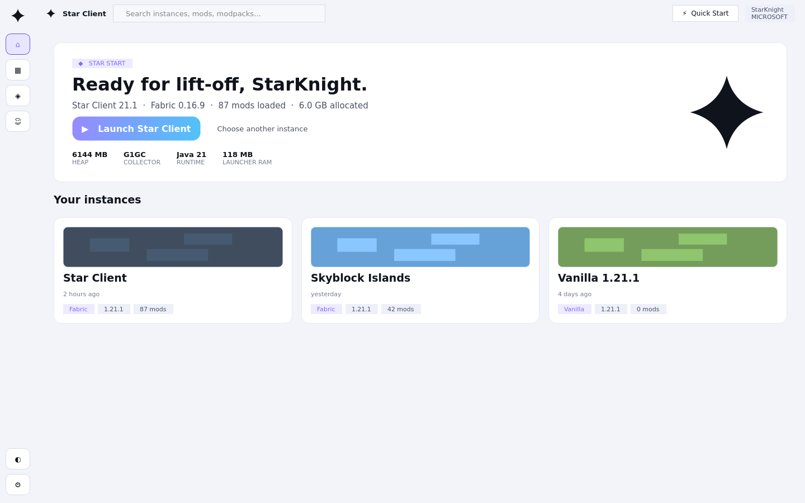

# Star Client

**Reach for the stars.**

A fast, lightweight Minecraft launcher for Windows. Star Client runs official
Microsoft accounts and offline profiles side by side, keeps its own memory
footprint small, and gives you real control over the JVM instead of a single
opaque "memory" box.

> Downloads live in **[Releases](../../releases)** — a portable `.zip` and an
> installer `.exe`. The source is this repository.

---

## Install

| | |
| --- | --- |
| **Portable** | Download `StarClient-*-windows-x64-portable.zip`, unzip anywhere, run `StarClient.exe`. Nothing is installed and nothing is written outside the extracted folder. |
| **Installer** | Download `StarClient-*-windows-x64-setup.exe` for a Start Menu entry and an uninstaller. |

Requires 64-bit Windows 10 or newer, and Java 17+ for Minecraft 1.18+
(Java 21 recommended). Star Client can download a runtime for you.

---

## What makes it different

### Real memory control
A slider with a safe band computed from your physical RAM and mod count, live
validation, quick presets from 2 GB to 16 GB, an auto-tune button, and warnings
when a value is too small to work or too large to help. It tells you *why* a
number is bad instead of letting you find out at launch.

### Garbage collector presets, not a JVM string
Pick **G1GC, ZGC, Generational ZGC, Shenandoah, Serial or Parallel**. Star
Client applies the matching flags, shows the exact resolved command line,
strips conflicting flags from your custom arguments, and resets to the tuned
default in one click.

### A launcher that stays small
Lazy icon decoding, a bounded thumbnail cache, caches released when Minecraft
starts, no bundled browser engine, and background work suspended during
gameplay.

### Star Menu
An optional set of quality-of-life presets that Star Client installs and
manages. Switch the whole set on or off **per instance**, because heavily
modded packs conflict with injected mods. Conflicting presets are disabled
automatically and the launcher names the file responsible. Nothing is deleted.

### OLED black, properly
Three themes — **OLED Black** (true `#000000`), **Midnight** and **Daylight** —
plus six accent presets. A four-pointed star mark that is white on dark themes
and ink on the light theme.

---

## Screens

Browser prototype (`prototype/`):

| OLED Black | Daylight | Quick Start |
| --- | --- | --- |
|  |  |  |

The same design rendered by **real Qt Widgets** with the generated stylesheet
(`prototype/qt/`) — the port the launcher ships:

| Qt · OLED Black | Qt · Daylight |
| --- | --- |
|  |  |

---

## How the theming works

One file — `theme/tokens.json` — is the single source of truth. It generates
the browser prototype's CSS, the launcher's Qt stylesheets **and** the C++
colour palettes, so the design surfaces cannot drift apart.

```
theme/tokens.json
        │
        ├─ tools/gen_theme.py ─► prototype/css/tokens.css            (CSS variables)
        │                     ─► src/theme/generated/*.qss            (one per theme)
        │                     ─► src/theme/generated/StarThemePalette.h
        │
        └─ tools/gen_logo.py  ─► branding/svg, branding/png, .ico, .icns
```

`launcher/ui/themes/StarTheme.cpp` loads those stylesheets from Qt resources
and applies the user's accent preset at runtime.

```bash
python3 tools/gen_theme.py            # regenerate every target
python3 tools/gen_theme.py --check    # fail if committed output is stale
python3 tools/gen_logo.py             # regenerate the star assets
node tools/gen_app_icons.js           # rebrand program_info icons
```

---

## Repository layout

```
theme/tokens.json          design source of truth
tools/                     generators (theme, logo, app icons, screenshots)
src/theme/                 Qt stylesheet template, icons, generated QSS
launcher/                  the launcher (inherited, rebranded)
launcher/ui/themes/        StarTheme: maps tokens onto Qt
prototype/                 browser prototype — the design reference
prototype/qt/              Qt Widgets harness — proves the port
program_info/              app identity: icons, desktop files, NSIS installer
docs/                      design, build and packaging documentation
```

---

## Building

See [`docs/BUILDING.md`](docs/BUILDING.md). Windows x64 is the primary target;
macOS follows.

CI builds on every push and pull request
([`.github/workflows/windows.yml`](.github/workflows/windows.yml)) and produces
both the portable zip and the installer. Pushing a `v*` tag attaches them to a
draft release.

---

## Licence

Star Client is free software released under the **GNU General Public License
v3.0**. See [`LICENSE`](LICENSE) and [`COPYING.md`](COPYING.md).

Attribution for the projects this fork is built on lives in
[`CREDITS.md`](CREDITS.md).

Minecraft is a trademark of Mojang Synergies AB. Star Client is not affiliated
with, endorsed by, or sponsored by Mojang or Microsoft.
